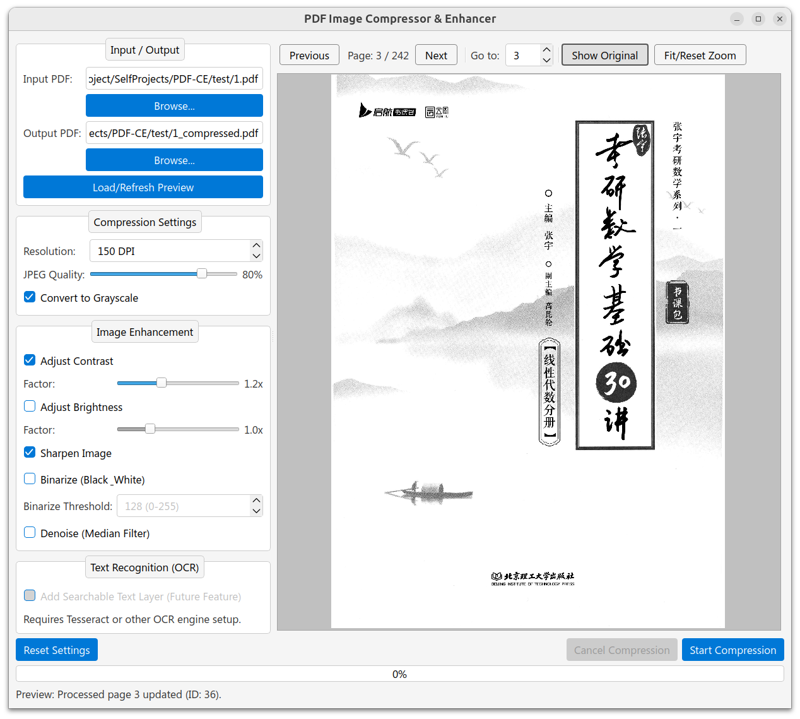

<h1 align='center'> PDF-CE: PDF Compressor & Enhancer for Scanned Documents</h1>

<div align="center">


</div>

[简体中文](./docs/README_zh.md)

## Overview

The PDF Compressor & Enhancer is a tool designed to compress and enhance images within PDF files. It provides various settings for compression and image enhancement, allowing users to optimize PDF files for different purposes.



## Getting Started

### Installation

#### Run from Executable

| Platform | Method |
|:---:|:---:|
| Windows 64bit | [Github Release](https://github.com/Qalxry/PDF-CE/releases/latest) |
|  Linux 64bit  | [Github Release](https://github.com/Qalxry/PDF-CE/releases/latest) |
|  MacOS 64bit  | Run from Source |

#### Run from Source

To run the application from source, follow these steps:

```shell
git clone https://github.com/Qalxry/PDF-CE.git
cd PDF-CE
pip install -r requirements.txt
python main.py
```

If you want to package the application into a single executable file, you can use PyInstaller. Make sure to install PyInstaller first:

```shell
pip install pyinstaller
```

Then, run the following command to create the executable:

```shell
pyinstaller pack.spec
```

This will create a `dist/build-{YYYYMMDD}-1.0.0` folder containing the executable file. You can run the executable directly without needing to install Python or any dependencies.

### Interface Overview

#### Input / Output

- **Input PDF**: Select the PDF file you want to compress and enhance.
- **Output PDF**: Specify the location and name for the output PDF file.
- **Load/Refresh Preview**: Load the selected PDF file and refresh the preview.

#### Compression Settings

- **Resolution**: Set the resolution of the output PDF (e.g., 80 DPI).
- **JPEG Quality**: Adjust the quality of JPEG images in the PDF.
- **Convert to Grayscale**: Convert all images in the PDF to grayscale.

#### Image Enhancement

- **Adjust Contrast**: Enhance the contrast of images.
  - **Factor**: Set the contrast adjustment factor (e.g., 1.2x).
- **Adjust Brightness**: Adjust the brightness of images.
  - **Factor**: Set the brightness adjustment factor (e.g., 1.0x).
- **Sharpen Image**: Sharpen the images.
- **Binarize (Black_White)**: Convert images to black and white.
  - **Binarize Threshold**: Set the threshold for binarization (0-255).
- **Denoise (Median Filter)**: Apply a median filter to reduce noise. But seems not working well.

#### Text Recognition (OCR)

Not implemented yet. Just a placeholder for future development.

#### Actions

- **Reset Settings**: Reset all settings to default.
- **Cancel Compression**: Cancel the ongoing compression process.
- **Start Compression**: Start the compression and enhancement process.

## TODOs

- [ ] fix: 修复书签和文本层丢失的问题
- [ ] feat: 将分辨率调整从 DPI 改为百分比，并在旁边显示当前 DPI 和页面分辨率，以便更好地理解和使用
- [ ] feat: 显示输入文件大小，并允许实时预览压缩后的文件大小（通过当前缓存的页面的压缩比计算）
- [ ] feat: 改进图像增强功能，允许更细致地调整，并允许保存配置
- [ ] feat: 添加命令行参数支持，允许用户在命令行中处理 PDF 文件，这样可以在没有 GUI 的情况下使用该工具，以及批量处理多个文件
- [ ] feat: 添加 OCR 功能

## Support

For any issues or feedback, please submit a issue on the GitHub repository.

## License

This application is licensed under the GPLv3 License. See the LICENSE file for details.

[](https://star-history.com/#Qalxry/PDF-CE&Date)
